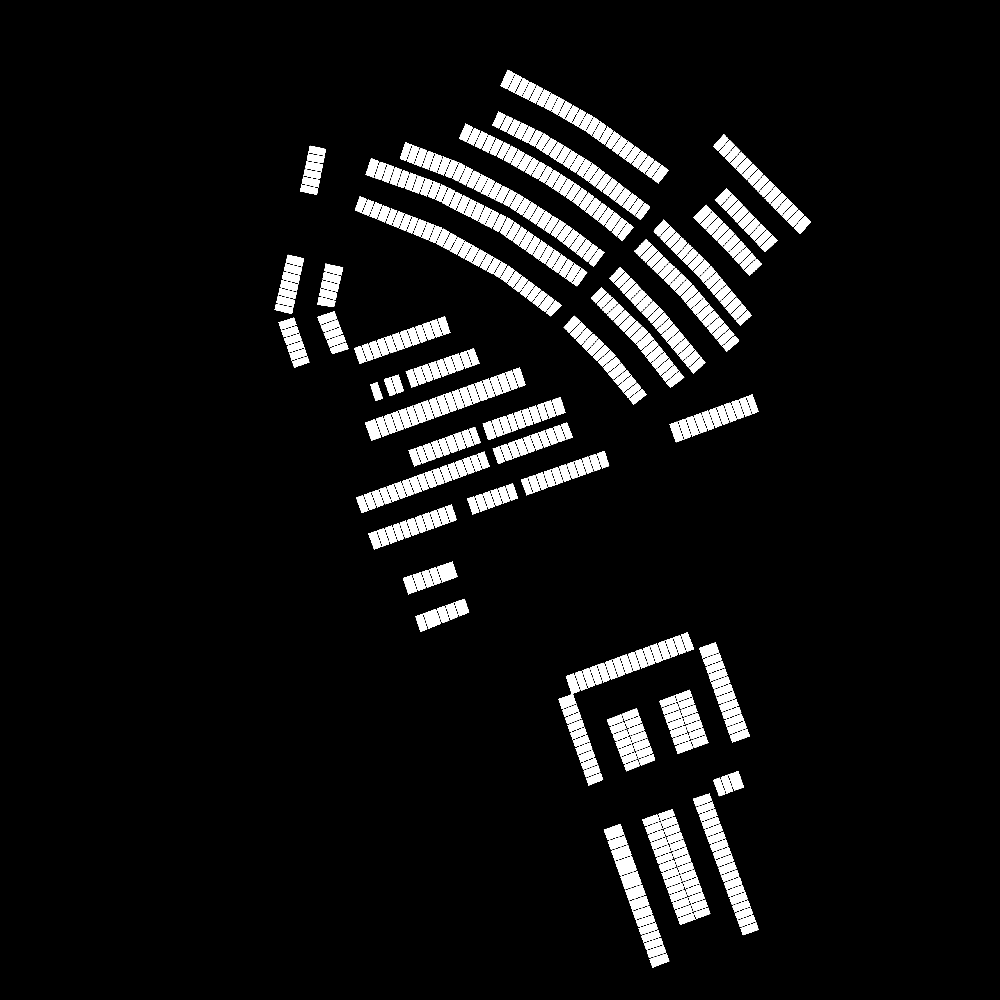
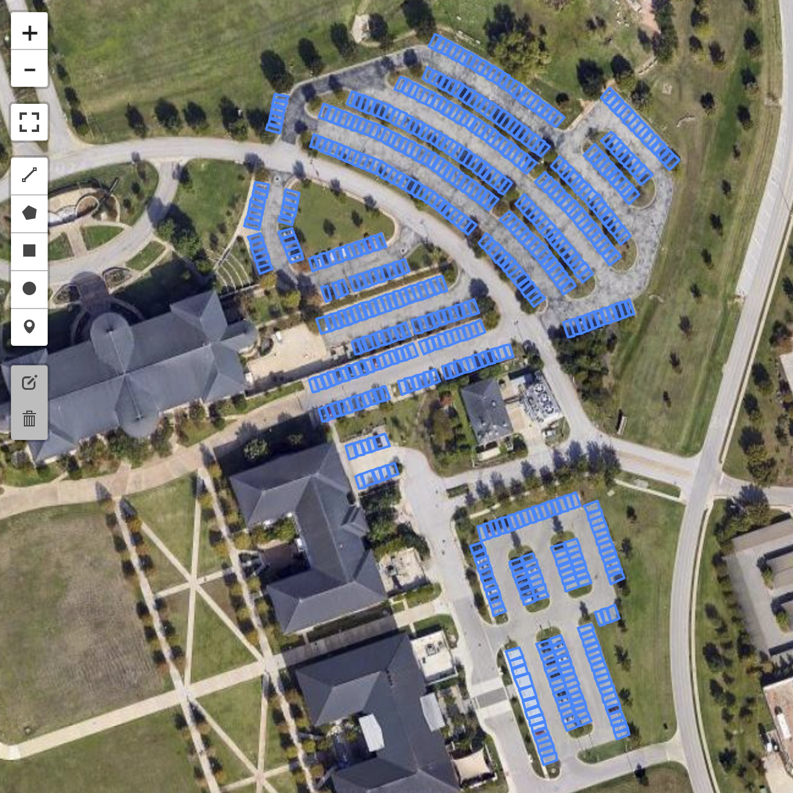
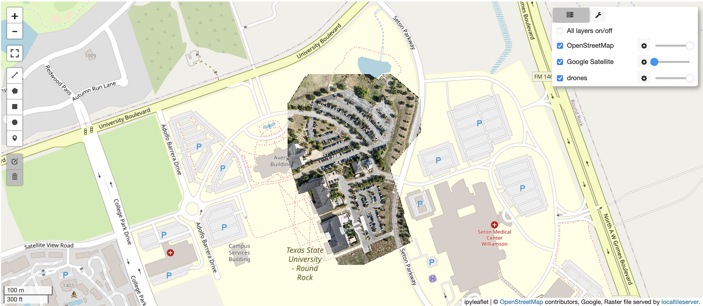

# Parking Lot Analysis

### 1. Raster to Vector
Converting a binary black-and-white mask of a parking lot into a GIS-compatible shapefile, streamlining the process of analyzing parking lot layouts and usage patterns, aiding in planning and traffic management efforts.

  

### 2. Drone to Map
Converting a georeferenced image into the GeoTIFF format, enabling precise alignment with geographical features and enhancing its usability for spatial analysis and visualization.

  
