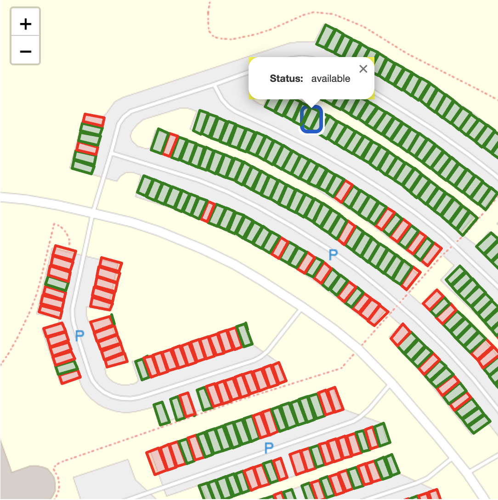
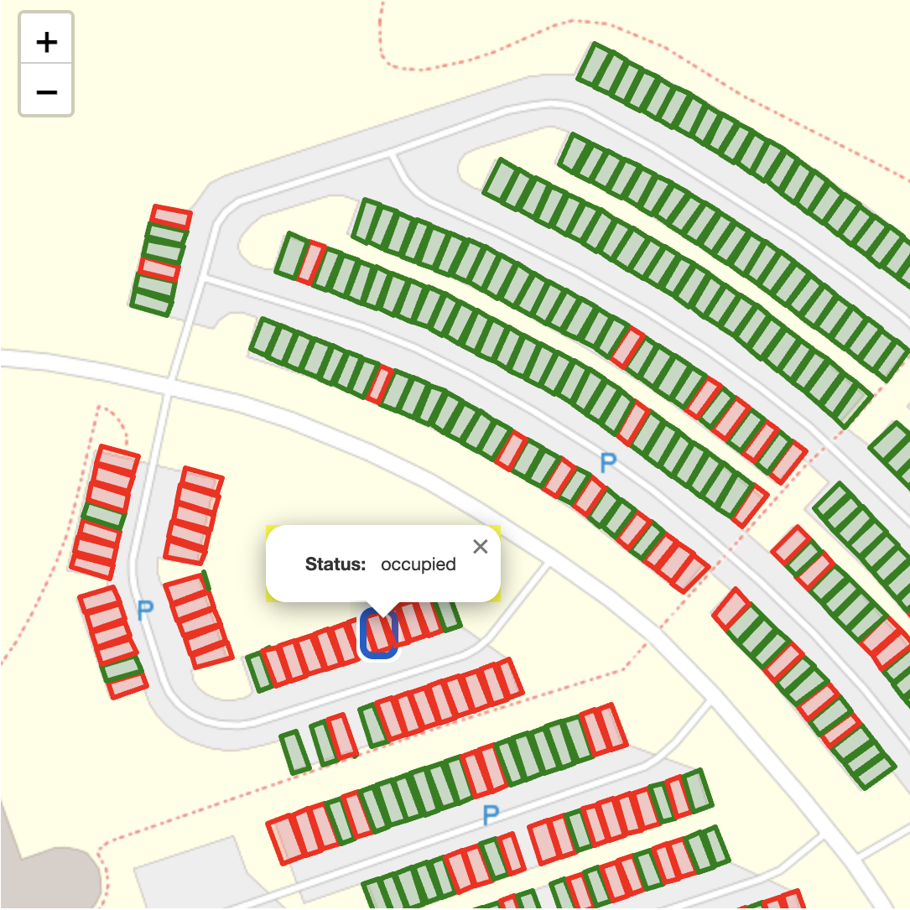

# Parking Lot Analysis

### 1. Drone to Map
Converting a georeferenced image into the GeoTIFF format, enabling precise alignment with geographical features and enhancing its usability for spatial analysis and visualization.

 

### 2. Raster to Vector
Converting a binary black-and-white mask of a parking lot into a GIS-compatible shapefile, streamlining the process of analyzing parking lot layouts and usage patterns.

  

### 3. Attribute Integration
Integrating additional attributes, like the status of individual parking stall, to the geospatial feature, enabling deeper analysis and insights.

  
